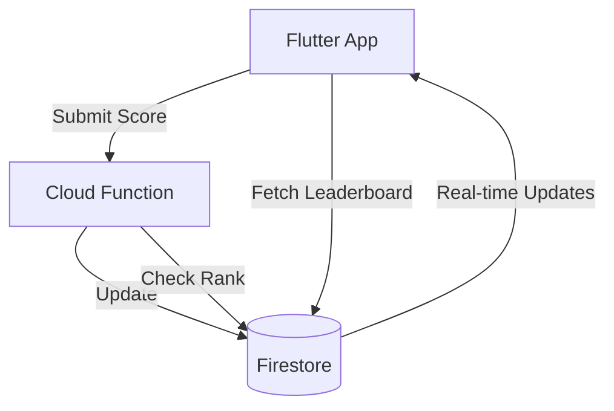

# Docsbuilder: AI-Powered Documentation Generator

## 🎯 One-Sentence Pitch

**"Describe your project in plain English, and AI generates complete, production-ready, arc42+C4 documentation with code patterns—optimized for GitHub Copilot."**

---

## ✨ The Magic

### Before (Current Questionnaires):
```
❌ Click through 15 questions
❌ Select from predefined options
❌ Limited to what we anticipated
❌ Takes 10-15 minutes
❌ Generic documentation
```

### After (AI-Powered):
```
✅ Type one sentence: "A mobile Flutter Pacman game with login, subscriptions, leaderboards"
✅ AI expands to full requirements in 10 seconds
✅ Review and refine in interactive screen
✅ One-click generates 45+ docs in 5 seconds
✅ Production-ready code patterns included
```

---

## 🚀 User Flow

### 1. Describe (5 seconds)
```
"A mobile Flutter Pacman-style game with user login, 
subscriptions, and leaderboards"
```

### 2. AI Expands (10 seconds)
```
Analyzing...

✓ Tech Stack Detected:
  - Frontend: Flutter (iOS + Android)
  - Backend: Firebase (Firestore, Auth, Functions)
  - Payments: In-App Purchases (Apple/Google)
  - Analytics: Firebase Analytics + Crashlytics

✓ Core Features:
  - Pacman-style game engine
  - User authentication (email + social login)
  - Subscription management
  - Global + friends leaderboards
  - Score persistence across devices

✓ Production Features (AI-Inferred):
  - Push notifications for challenges/events
  - Offline play mode with sync
  - Achievement system
  - Daily challenges
  - Secure data storage
  - Rate limiting & abuse prevention
  - CI/CD pipeline (GitHub Actions)
  - App Store + Google Play deployment

✓ Architecture:
  - arc42 documentation structure
  - C4 model diagrams (Context, Container, Component)
  - 15 applicable patterns selected

✓ Smart Questions:
  - "Do you want social login (Google, Apple, Facebook)?"
  - "Should leaderboards update in real-time?"
  - "Do you need chat/messaging between players?"
```

### 3. Review & Refine (1 minute)
```
[Interactive UI showing all expanded requirements]

User can:
✏️  Edit any section
➕ Add missing features
❌ Remove unnecessary items
💬 Ask AI follow-up questions
✅ Confirm and generate
```

### 4. Generate (5 seconds)
```
Generating documentation...

✅ Created 45 markdown files
✅ Generated 4 C4 diagrams
✅ Injected 15 code patterns (Flutter + Firebase specific)
✅ Added metadata blocks for AI comprehension
✅ Cross-referenced all documentation
✅ Quality score: 95/100

Ready to export or view!
```

---

## 📁 What Gets Generated

### Project Documentation (5 files)
- `overview.md` - Project summary with metadata
- `requirements.md` - Functional & non-functional requirements
- `goals-and-constraints.md` - Success criteria, limitations
- `stakeholders.md` - Roles, responsibilities
- `context-and-scope.md` - System boundaries

### Architecture (6 files + diagrams)
- `system-context.md` - C4 Level 1 diagram
- `containers.md` - C4 Level 2 diagram
- `components.md` - C4 Level 3 diagram
- `tech-stack.md` - Flutter, Firebase, iOS/Android details
- `solution-strategy.md` - Architecture decisions
- `deployment-view.md` - App Store + Play Store deployment

### Patterns (15+ files with code)
```
/patterns/
  auth/
    jwt-authentication.md (with Firebase code)
    social-login.md (Google, Apple integration)
  gaming/
    leaderboard-implementation.md (Firestore queries)
    achievement-system.md (Flutter widgets + logic)
    game-state-sync.md (Offline-first architecture)
  payments/
    iap-subscriptions.md (RevenueCat or native)
  mobile/
    offline-mode.md (Hive + sync logic)
    push-notifications.md (FCM setup)
  [... 8 more patterns]
```

### Features (5+ files)
- `game-engine.md` - Pacman game logic implementation
- `user-authentication.md` - Login flows with Firebase
- `subscription-management.md` - IAP integration
- `leaderboard-system.md` - Global + friends leaderboards
- `push-notifications.md` - Challenge notifications

### API Documentation (4 files)
- `rest-endpoints.md` - Firebase Functions API
- `authentication.md` - Firebase Auth flows
- `error-handling.md` - Error codes and responses

### Testing (4 files)
- `strategy.md` - Test approach
- `unit-tests.md` - Flutter widget tests
- `integration-tests.md` - Firebase integration tests
- `e2e-tests.md` - Full app flow tests

### Deployment (4 files)
- `environments.md` - Dev, staging, production
- `ci-cd.md` - GitHub Actions workflow
- `monitoring.md` - Firebase Analytics + Crashlytics
- `app-store-deployment.md` - iOS/Android release process

### Security (4 files)
- `overview.md` - Security architecture
- `authentication.md` - Firebase Auth security rules
- `data-protection.md` - Firestore security rules
- `compliance.md` - GDPR, privacy policy

---

## 🎨 Example: Generated Pattern

### File: `/patterns/gaming/leaderboard-implementation.md`

```markdown
---
patternId: leaderboard-implementation
arc42Section: Building Blocks (Section 5)
c4Level: Component
domain: gaming
techStack:
  mobile: Flutter
  backend: Firebase
  database: Firestore
dependencies:
  - user-authentication
  - real-time-sync
complexity: moderate
timeToImplement: 4-6 hours
productionReady: true
---

# Leaderboard Implementation (Gaming)

## Overview
Scalable leaderboard system supporting global rankings, friend rankings, 
and time-based leaderboards (daily, weekly, all-time).

## C4 Component Diagram


## Implementation (Flutter + Firebase)

### 1. Firestore Data Model
```javascript
// Collection: leaderboards/{leaderboardType}/scores/{userId}
{
  userId: 'abc123',
  username: 'Player1',
  score: 15000,
  rank: 42,
  timestamp: Timestamp.now(),
  metadata: {
    level: 10,
    playTime: 3600 // seconds
  }
}
```

### 2. Submit Score (Cloud Function)
```typescript
// functions/src/leaderboard.ts
export const submitScore = functions.https.onCall(async (data, context) => {
  const { score, leaderboardType } = data;
  const userId = context.auth.uid;
  
  // Validate auth
  if (!userId) throw new Error('Unauthorized');
  
  // Get user's current best score
  const userScoreRef = db
    .collection(`leaderboards/${leaderboardType}/scores`)
    .doc(userId);
    
  const currentScore = await userScoreRef.get();
  
  // Only update if new score is higher
  if (!currentScore.exists || score > currentScore.data().score) {
    await userScoreRef.set({
      userId,
      username: context.auth.token.name,
      score,
      timestamp: admin.firestore.FieldValue.serverTimestamp()
    });
    
    // Recalculate rank (background job)
    await recalculateRanks(leaderboardType);
    
    return { success: true, newRank: await getUserRank(userId, leaderboardType) };
  }
  
  return { success: false, message: 'Score not high enough' };
});
```

### 3. Flutter Widget
```dart
// lib/widgets/leaderboard_widget.dart
class LeaderboardWidget extends StatelessWidget {
  final LeaderboardType type;
  
  @override
  Widget build(BuildContext context) {
    return StreamBuilder<QuerySnapshot>(
      stream: FirebaseFirestore.instance
        .collection('leaderboards/${type.name}/scores')
        .orderBy('score', descending: true)
        .limit(100)
        .snapshots(),
      builder: (context, snapshot) {
        if (!snapshot.hasData) {
          return CircularProgressIndicator();
        }
        
        final scores = snapshot.data!.docs;
        
        return ListView.builder(
          itemCount: scores.length,
          itemBuilder: (context, index) {
            final score = scores[index].data() as Map<String, dynamic>;
            return LeaderboardTile(
              rank: index + 1,
              username: score['username'],
              score: score['score'],
              isCurrentUser: score['userId'] == currentUserId,
            );
          },
        );
      },
    );
  }
}
```

## Performance Considerations
- Use composite indexes for complex queries
- Implement pagination for large leaderboards (100+ entries)
- Cache frequently accessed leaderboards (top 10, friends)
- Use Cloud Functions for rank calculation (don't do client-side)

## Security Rules
```javascript
// firestore.rules
match /leaderboards/{leaderboardType}/scores/{userId} {
  allow read: if true; // Public leaderboards
  allow write: if false; // Only via Cloud Functions
}
```

## Best Practices
- Store only top N scores per user (save storage)
- Implement anti-cheat validation in Cloud Functions
- Use time-based leaderboards (reset daily/weekly)
- Show user's rank even if not in top 100
- Cache leaderboard data for 1-5 minutes

## Related Patterns
- [Real-time Sync](../mobile/real-time-sync.md)
- [User Authentication](../auth/firebase-auth.md)
- [Achievement System](./achievement-system.md)
```

---

## 🧠 How AI Understands This

### Metadata Block (Machine-Readable)
```yaml
---
patternId: leaderboard-implementation
arc42Section: Building Blocks (Section 5)
c4Level: Component
domain: gaming
techStack:
  mobile: Flutter
  backend: Firebase
  database: Firestore
dependencies:
  - user-authentication
  - real-time-sync
---
```

**GitHub Copilot can now:**
- Understand this is a gaming leaderboard
- Know it uses Flutter + Firebase
- See it depends on authentication
- Generate code that matches this exact pattern
- Suggest related features (achievements, challenges)

---

## 🎁 Bonus Features

### 1. Voice Input
```
User: "Hey Docsbuilder, create documentation for..." [speaks description]
AI: [Transcribes and processes]
```

### 2. Template Suggestions
```
AI: "This sounds like a mobile game. Would you like to start with our 
     'Mobile Game Template'? It includes: game engine, IAP, leaderboards, 
     achievements, and social features."
     
User: "Yes!"
AI: [Pre-fills requirements, user can refine]
```

### 3. Incremental Refinement
```
User: [After generation] "Add multiplayer matchmaking"
AI: [Adds multiplayer patterns, updates architecture, regenerates affected docs]
```

### 4. Export Options
- 📄 PDF with table of contents
- 🌐 Interactive HTML site
- 📦 GitHub repo with `/docs` folder
- 📋 Notion/Confluence import
- 💼 Slide deck for stakeholders

---

## 📊 Comparison

| Feature | Old Questionnaire | New AI-Powered |
|---------|-------------------|----------------|
| **Input Method** | Click through 15 questions | Type 1 sentence |
| **Time to Input** | 10-15 minutes | 30 seconds |
| **Flexibility** | Limited to predefined options | Unlimited, any project type |
| **Customization** | Minimal | Full review and edit |
| **Pattern Selection** | Manual/static | AI-inferred, dependency-aware |
| **Documentation Quality** | Generic | Production-ready, tech-specific |
| **Code Examples** | Generic snippets | Full implementations for your stack |
| **Diagrams** | None | C4 diagrams (Context, Container, Component) |
| **AI Optimization** | Basic | Rich metadata, cross-references |
| **Feels Like** | Filling out a form | Having a conversation with an architect |

---

## 🚀 Next Steps

1. **Review the complete roadmap**: [AI-Powered Roadmap](./docs/research/AI-POWERED-ROADMAP.md)
2. **Set up AI API key**: OpenAI (GPT-4) or Anthropic (Claude)
3. **Implement Phase 1**: Freeform input + AI expansion service
4. **Build Phase 2**: Advanced pattern library
5. **Enhance Phase 3**: Metadata, diagrams, validation

---

## 🎯 Success Metrics

- **User Delight**: "Wow, this is magic!"
- **Time Savings**: 10 minutes → 2 minutes (80% reduction)
- **Documentation Quality**: 90%+ quality score
- **AI Comprehension**: GitHub Copilot generates correct code on first try
- **Adoption**: 10x increase in completed documentation

---

**Status**: Phase 1 (Doc Generation) ✅ | Phases 2-3 (AI + Patterns) ⏳  
**Timeline**: 6 weeks  
**Impact**: Revolutionary documentation experience
