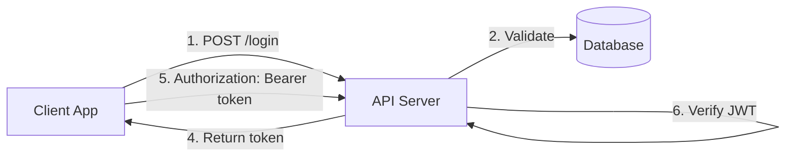

# Implementation Roadmap: AI-Powered Documentation Generation

**Status**: Ready for Implementation  
**Priority**: High  
**Related Documents**: 
- [Full Research Document](./ai-ready-documentation-research.md)
- **[NEW: AI-Powered Roadmap](./AI-POWERED-ROADMAP.md)** ⭐ Complete implementation guide

---

## 🎯 Vision

Transform project documentation from a tedious, time-consuming process into a **simple, conversational experience**. Users describe their project in plain English, and AI generates complete, production-ready, arc42+C4 documentation with code patterns, diagrams, and metadata optimized for GitHub Copilot and other AI development tools.

## 🚀 Quick Start

**For the complete, up-to-date implementation guide with AI-powered freeform input, see:**  
👉 **[AI-Powered Roadmap](./AI-POWERED-ROADMAP.md)**

### New User Experience:
1. **User types**: "A mobile Flutter Pacman-style game with user login, subscriptions, and leaderboards"
2. **AI expands**: Tech stack, core + production features, patterns, architecture
3. **User reviews**: Edit, confirm, or ask clarifying questions
4. **One-click generate**: 45+ docs with metadata, diagrams, and code patterns

---

## 📌 Implementation Status

### ✅ Phase 1: Core Documentation (COMPLETE)
- [x] 45+ markdown files generated
- [x] arc42 structure implemented
- [x] Technology-specific content maps
- [x] Enhanced interview questions
- [x] Documentation viewer with export

### ⏳ Phase 2: AI Requirements Capture (IN PROGRESS)
See [AI-Powered Roadmap](./AI-POWERED-ROADMAP.md) for:
- [ ] Freeform input component
- [ ] AI expansion service (GPT-4/Claude integration)
- [ ] Interactive requirements review screen
- [ ] Smart clarification questions

### ⏳ Phase 3: Advanced Pattern Library
See [AI-Powered Roadmap](./AI-POWERED-ROADMAP.md) for:
- [ ] 30+ production-ready patterns
- [ ] Pattern selection algorithm
- [ ] arc42+C4 compliant pattern docs
- [ ] Technology-specific code examples

### ⏳ Phase 4: Enhanced Generation
See [AI-Powered Roadmap](./AI-POWERED-ROADMAP.md) for:
- [ ] Metadata blocks for AI comprehension
- [ ] C4 diagram generation
- [ ] Pattern integration
- [ ] Documentation validation
- [ ] Quality scoring

---

## Quick Reference

### What We Discovered

1. **arc42 + C4 Model** are the industry standards for software architecture documentation
2. **Structured formatting** with metadata significantly improves AI comprehension
3. **40+ documentation files** across 12 categories provides optimal context
4. **Pattern-based generation** ensures consistency and completeness
5. **Freeform input + AI expansion** is more user-friendly and powerful than rigid questionnaires
6. **Intent inference** allows AI to add production-grade requirements users might overlook

### What We Need to Build

1. **AI-powered requirements capture** using natural language processing
2. **Smart intent expansion** to infer production needs from user descriptions
3. **Interactive review system** for users to confirm and refine requirements
4. **Advanced pattern library** with arc42+C4 compliance and rich metadata
5. **Automated documentation generator** creating 45+ interconnected files
6. **One-click generation** with real-time preview and export

---

## User Experience Flow

### 1. Freeform Project Description
**User sees:** A simple, friendly input box with prompt:  
*"Describe your project in plain English. For example: 'A mobile Flutter Pacman-style game with user login, subscriptions, and leaderboards.'"*

**User types/speaks:** Any natural description of their project idea.

### 2. AI-Powered Intent Expansion
**Behind the scenes:**
- AI model (GPT-4, Claude) parses the description
- Extracts: tech stack, domain, features, user types, scale, deployment targets
- Infers production needs: authentication, payments, analytics, notifications, security, error handling, scaling, CI/CD
- Generates comprehensive requirements list with rationale

### 3. Interactive Review Screen
**User sees:** Expanded requirements with sections:
- **Tech Stack**: Flutter, Firebase, iOS/Android deployment
- **Core Features**: Game logic, user auth, subscriptions, leaderboards
- **Production Features**: Push notifications, analytics, crash reporting, secure storage
- **Architecture**: arc42 sections, C4 diagrams
- **Patterns**: Authentication, payment integration, leaderboard sync, etc.

**User can:**
- ✅ Confirm requirements
- ✏️ Edit or refine any item
- ➕ Add missing requirements
- ❌ Remove unnecessary items
- 💬 Ask follow-up questions (AI responds contextually)

### 4. Smart Clarification Questions
**AI asks only when needed:**
- "Do you want social login (Google, Apple) in addition to email/password?"
- "Should leaderboards sync across devices in real-time?"
- "Would you like daily/weekly challenges to increase engagement?"
- "Do you need offline play mode?"

### 5. Pattern & Documentation Generation
**One-click generation creates:**
- ✅ 45+ markdown files (arc42 structure)
- ✅ C4 diagrams (Context, Container, Component, Code)
- ✅ Metadata blocks for AI comprehension
- ✅ Code patterns specific to Flutter + Firebase
- ✅ Cross-referenced documentation
- ✅ Production-ready architecture guide

### 6. Documentation Viewer
**User sees:**
- File tree with all generated docs
- Real-time markdown preview
- Inline editing capability
- Export options (JSON, Markdown ZIP, PDF)
- Quality score and validation report

---

## Phase 1: AI Requirements Capture (Weeks 1-2)

### Goal
Build the AI-powered requirements capture system that understands freeform project descriptions and expands them into comprehensive, production-ready specifications.

### Tasks

#### 1. Create AI Integration Layer

**File**: `src/services/aiService.ts`

```typescript
interface ProjectDescription {
  rawInput: string;
  timestamp: string;
}

interface ExpandedRequirements {
  projectSummary: string;
  techStack: {
    frontend?: string[];
    backend?: string[];
    database?: string[];
    mobile?: string[];
    deployment?: string[];
  };
  coreFeatures: Feature[];
  productionFeatures: Feature[];
  inferredNeeds: {
    category: string;
    items: string[];
    rationale: string;
  }[];
  suggestedPatterns: string[];
  clarificationQuestions: Question[];
}

interface Feature {
  id: string;
  name: string;
  description: string;
  category: 'core' | 'production' | 'optional';
  priority: 'must-have' | 'should-have' | 'nice-to-have';
  dependencies: string[];
  patterns: string[];
}

// AI-powered expansion service
export const expandProjectDescription = async (
  description: string
): Promise<ExpandedRequirements> => {
  const prompt = `
You are a senior software architect and product manager. A user has described their project idea:

"${description}"

Your task:
1. Parse this description to extract tech stack, features, domain, and user intent.
2. Infer production-grade needs the user may have overlooked (auth, payments, analytics, security, scaling, monitoring, CI/CD, etc.).
3. Suggest best practices and patterns for this type of project.
4. Generate clarification questions only if critical information is ambiguous.

Return a JSON object with:
- projectSummary: One-sentence summary
- techStack: { frontend, backend, database, mobile, deployment }
- coreFeatures: Array of explicitly mentioned features
- productionFeatures: Array of inferred production needs
- inferredNeeds: Categories of additional requirements with rationale
- suggestedPatterns: IDs of applicable implementation patterns
- clarificationQuestions: Array of smart follow-up questions

Be comprehensive but concise. Focus on production-ready, scalable solutions.
`;

  // Call AI API (OpenAI, Anthropic, etc.)
  const response = await fetch('https://api.openai.com/v1/chat/completions', {
    method: 'POST',
    headers: {
      'Content-Type': 'application/json',
      'Authorization': `Bearer ${import.meta.env.VITE_OPENAI_API_KEY}`
    },
    body: JSON.stringify({
      model: 'gpt-4',
      messages: [
        { role: 'system', content: 'You are an expert software architect.' },
        { role: 'user', content: prompt }
      ],
      temperature: 0.7,
      response_format: { type: 'json_object' }
    })
  });

  const data = await response.json();
  return JSON.parse(data.choices[0].message.content);
};
```

#### 2. Build Freeform Input Component

**File**: `src/components/interview/FreeformInput.tsx`

```typescript
export const FreeformInput: React.FC = () => {
  const [description, setDescription] = useState('');
  const [isExpanding, setIsExpanding] = useState(false);

  const examples = [
    "A mobile Flutter Pacman-style game with user login, subscriptions, and leaderboards",
    "A SaaS platform for freelancers to find clients with payments and messaging",
    "An e-commerce store selling handmade crafts with inventory management",
    "A social network for pet owners to share photos and connect locally"
  ];

  const handleSubmit = async () => {
    setIsExpanding(true);
    const expanded = await expandProjectDescription(description);
    // Navigate to review screen with expanded requirements
    onExpand(expanded);
  };

  return (
    <div className="max-w-4xl mx-auto p-8">
      <h1 className="text-3xl font-bold mb-4">
        Describe Your Project
      </h1>
      <p className="text-gray-600 dark:text-gray-400 mb-8">
        Tell us what you want to build in plain English. Our AI will expand it into 
        a complete project specification with architecture, patterns, and documentation.
      </p>

      <textarea
        value={description}
        onChange={(e) => setDescription(e.target.value)}
        placeholder="Example: A mobile Flutter Pacman-style game with user login, subscriptions, and leaderboards"
        className="w-full h-32 p-4 border rounded-lg"
      />

      <div className="mt-4">
        <p className="text-sm text-gray-600 mb-2">Examples:</p>
        {examples.map((ex, i) => (
          <button
            key={i}
            onClick={() => setDescription(ex)}
            className="text-sm text-cyan-600 hover:underline block"
          >
            {ex}
          </button>
        ))}
      </div>

      <button
        onClick={handleSubmit}
        disabled={!description.trim() || isExpanding}
        className="mt-6 px-6 py-3 bg-cyan-500 text-white rounded-lg"
      >
        {isExpanding ? 'Analyzing...' : 'Expand Requirements'}
      </button>
    </div>
  );
};
```

#### 3. Create Requirements Review Screen

**File**: `src/components/interview/RequirementsReview.tsx`

```typescript
interface RequirementsReviewProps {
  expanded: ExpandedRequirements;
  onConfirm: (refined: ExpandedRequirements) => void;
  onEdit: (requirements: ExpandedRequirements) => void;
}

export const RequirementsReview: React.FC<RequirementsReviewProps> = ({
  expanded,
  onConfirm,
  onEdit
}) => {
  const [requirements, setRequirements] = useState(expanded);
  const [activeQuestion, setActiveQuestion] = useState(0);

  return (
    <div className="max-w-6xl mx-auto p-8">
      <h1 className="text-3xl font-bold mb-4">
        Review Your Project Requirements
      </h1>
      
      {/* Project Summary */}
      <section className="mb-8 p-6 bg-cyan-50 dark:bg-cyan-900 rounded-lg">
        <h2 className="text-xl font-semibold mb-2">Project Summary</h2>
        <p>{requirements.projectSummary}</p>
      </section>

      {/* Tech Stack */}
      <section className="mb-8">
        <h2 className="text-2xl font-semibold mb-4">Tech Stack</h2>
        <TechStackGrid stack={requirements.techStack} onEdit={setRequirements} />
      </section>

      {/* Core Features */}
      <section className="mb-8">
        <h2 className="text-2xl font-semibold mb-4">Core Features</h2>
        <FeatureList features={requirements.coreFeatures} onEdit={setRequirements} />
      </section>

      {/* Production Features */}
      <section className="mb-8">
        <h2 className="text-2xl font-semibold mb-4">Production Features (AI-Suggested)</h2>
        <FeatureList features={requirements.productionFeatures} onEdit={setRequirements} />
      </section>

      {/* Clarification Questions */}
      {requirements.clarificationQuestions.length > 0 && (
        <section className="mb-8">
          <h2 className="text-2xl font-semibold mb-4">Quick Questions</h2>
          <ClarificationQuestions 
            questions={requirements.clarificationQuestions}
            onAnswer={(answers) => refineRequirements(requirements, answers)}
          />
        </section>
      )}

      {/* Actions */}
      <div className="flex gap-4">
        <button
          onClick={() => onConfirm(requirements)}
          className="px-6 py-3 bg-cyan-500 text-white rounded-lg"
        >
          Generate Documentation
        </button>
        <button
          onClick={() => onEdit(requirements)}
          className="px-6 py-3 border rounded-lg"
        >
          Edit Requirements
        </button>
      </div>
    </div>
  );
};
```

#### 4. Enhance Interview Data Model

**File**: `src/types/requirements.ts`

```typescript
export interface ProjectRequirements {
  // Raw user input
  rawDescription: string;
  
  // AI-expanded data
  projectSummary: string;
  domain: string; // e.g., "gaming", "saas", "ecommerce"
  scale: 'mvp' | 'small' | 'medium' | 'large' | 'enterprise';
  
  // Tech stack
  techStack: TechStack;
  
  // Features
  coreFeatures: Feature[];
  productionFeatures: Feature[];
  optionalFeatures: Feature[];
  
  // Architecture
  arc42Sections: Arc42Section[];
  c4Diagrams: C4Diagram[];
  
  // Patterns
  selectedPatterns: Pattern[];
  
  // Metadata
  metadata: {
    generatedAt: string;
    aiModel: string;
    confidence: number;
    tags: string[];
  };
}

export interface Arc42Section {
  id: string;
  number: number; // 1-12
  title: string;
  content: string;
  relatedFeatures: string[];
}

export interface C4Diagram {
  level: 'context' | 'container' | 'component' | 'code';
  title: string;
  diagram: string; // ASCII or Mermaid
  description: string;
}
```

### Deliverables

- [x] 45+ documentation files already generated ✅ (Phase 1 from old roadmap complete)
- [ ] AI integration service for requirement expansion
- [ ] Freeform input component with voice support
- [ ] Interactive requirements review screen
- [ ] Smart clarification question system
- [ ] Enhanced data model for AI-powered flow

---

## Phase 3: Enhanced Documentation Generation (Weeks 5-6)

### Goal
Create a comprehensive, AI-optimized pattern library with arc42+C4 compliance, rich metadata, dependency tracking, and technology-specific implementations.

### Tasks

#### 1. Enhanced Pattern Interface

**File**: `src/data/patterns/types.ts`

```typescript
export interface Pattern {
  // Identity
  id: string;
  name: string;
  description: string;
  category: 'auth' | 'api' | 'database' | 'frontend' | 'backend' | 'deployment' | 'integration';
  
  // arc42 + C4 Compliance
  arc42Section: string; // e.g., "Building Blocks (Section 5)"
  c4Level: 'context' | 'container' | 'component' | 'code';
  
  // Applicability
  applicableFor: {
    domains?: string[]; // e.g., ["gaming", "saas", "ecommerce"]
    frontend?: string[];
    backend?: string[];
    database?: string[];
    mobile?: string[];
    scale?: ('mvp' | 'small' | 'medium' | 'large' | 'enterprise')[];
  };
  
  // Dependencies & Relationships
  dependencies: string[]; // Pattern IDs this pattern requires
  relatedPatterns: string[]; // Pattern IDs that complement this
  conflicts: string[]; // Pattern IDs that conflict with this
  
  // Metadata for AI Comprehension
  metadata: {
    complexity: 'simple' | 'moderate' | 'complex';
    timeToImplement: string; // e.g., "2-4 hours"
    expertiseRequired: 'beginner' | 'intermediate' | 'advanced';
    productionReady: boolean;
    tags: string[];
  };
  
  // Documentation
  documentation: string; // Full markdown documentation
  rationale: string; // Why use this pattern
  tradeoffs: string; // Pros and cons
  alternatives: string[]; // Alternative pattern IDs
  
  // C4 Diagrams
  diagrams: {
    context?: string; // ASCII or Mermaid
    container?: string;
    component?: string;
    code?: string;
  };
  
  // Code Examples (technology-specific)
  codeExamples: {
    [techStack: string]: {
      setup?: string;
      implementation: string;
      tests?: string;
      deployment?: string;
    };
  };
  
  // Best Practices & Security
  bestPractices: string[];
  securityConsiderations: string[];
  performanceNotes: string[];
  
  // Real-world Examples
  examples: {
    description: string;
    company?: string; // e.g., "Used by Airbnb"
    link?: string;
  }[];
}
```

#### 2. Pattern Selection Algorithm

**File**: `src/utils/patternSelector.ts`

```typescript
interface SelectionContext {
  requirements: ProjectRequirements;
  techStack: TechStack;
  domain: string;
  scale: string;
  budget?: 'low' | 'medium' | 'high';
}

export class PatternSelector {
  private patterns: Pattern[];
  
  constructor(patterns: Pattern[]) {
    this.patterns = patterns;
  }
  
  /**
   * Select applicable patterns based on project requirements
   */
  selectPatterns(context: SelectionContext): Pattern[] {
    let applicable = this.patterns.filter(pattern => 
      this.isApplicable(pattern, context)
    );
    
    // Resolve dependencies
    applicable = this.resolveDependencies(applicable);
    
    // Remove conflicts
    applicable = this.resolveConflicts(applicable);
    
    // Sort by priority (dependencies first, then by complexity)
    applicable = this.sortByPriority(applicable);
    
    return applicable;
  }
  
  private isApplicable(pattern: Pattern, context: SelectionContext): boolean {
    const { requirements, techStack, domain, scale } = context;
    
    // Check domain applicability
    if (pattern.applicableFor.domains && 
        !pattern.applicableFor.domains.includes(domain)) {
      return false;
    }
    
    // Check tech stack match
    if (pattern.applicableFor.frontend && 
        techStack.frontend && 
        !pattern.applicableFor.frontend.includes(techStack.frontend[0])) {
      return false;
    }
    
    if (pattern.applicableFor.backend && 
        techStack.backend &&
        !pattern.applicableFor.backend.includes(techStack.backend[0])) {
      return false;
    }
    
    // Check scale appropriateness
    if (pattern.applicableFor.scale && 
        !pattern.applicableFor.scale.includes(scale as any)) {
      return false;
    }
    
    // Check if required by features
    const requiredByFeatures = requirements.coreFeatures.some(feature =>
      feature.patterns.includes(pattern.id)
    ) || requirements.productionFeatures.some(feature =>
      feature.patterns.includes(pattern.id)
    );
    
    return requiredByFeatures;
  }
  
  private resolveDependencies(patterns: Pattern[]): Pattern[] {
    const resolved = new Set<string>();
    const result: Pattern[] = [];
    
    const addWithDeps = (pattern: Pattern) => {
      if (resolved.has(pattern.id)) return;
      
      // Add dependencies first
      pattern.dependencies.forEach(depId => {
        const dep = this.patterns.find(p => p.id === depId);
        if (dep) addWithDeps(dep);
      });
      
      result.push(pattern);
      resolved.add(pattern.id);
    };
    
    patterns.forEach(addWithDeps);
    return result;
  }
  
  private resolveConflicts(patterns: Pattern[]): Pattern[] {
    const filtered: Pattern[] = [];
    const included = new Set<string>();
    
    for (const pattern of patterns) {
      const hasConflict = pattern.conflicts.some(c => included.has(c));
      if (!hasConflict) {
        filtered.push(pattern);
        included.add(pattern.id);
      }
    }
    
    return filtered;
  }
  
  private sortByPriority(patterns: Pattern[]): Pattern[] {
    return patterns.sort((a, b) => {
      // Dependencies first
      if (b.dependencies.includes(a.id)) return -1;
      if (a.dependencies.includes(b.id)) return 1;
      
      // Then by complexity (simple first)
      const complexityOrder = { simple: 0, moderate: 1, complex: 2 };
      return complexityOrder[a.metadata.complexity] - 
             complexityOrder[b.metadata.complexity];
    });
  }
}
```

#### 3. Core Patterns Library

**File**: `src/data/patterns/index.ts`

**Create 30+ production-ready patterns across categories:**

**Authentication Patterns** (5 patterns):
- JWT Authentication (with refresh tokens)
- OAuth 2.0 Integration (Google, Apple, GitHub)
- Session-Based Authentication
- Password Reset Flow
- Two-Factor Authentication (TOTP, SMS)

**API Patterns** (7 patterns):
- RESTful CRUD Operations
- GraphQL Schema Design
- API Pagination (offset, cursor-based)
- Filtering & Sorting
- Rate Limiting & Throttling
- API Versioning (URL, header, content negotiation)
- Webhook Implementation

**Database Patterns** (6 patterns):
- User Schema (with roles & permissions)
- One-to-Many Relationships
- Many-to-Many Relationships
- Soft Delete Pattern
- Audit Fields (created_at, updated_at, deleted_at)
- Database Migrations & Versioning

**Frontend Patterns** (8 patterns):
- Form Handling & Validation
- Data Fetching & Caching (React Query, SWR)
- Loading & Error States
- Optimistic Updates
- Protected Routes & Authorization
- Infinite Scroll / Virtual Lists
- File Upload with Progress
- Real-time Updates (WebSocket, SSE)

**Backend Patterns** (6 patterns):
- Middleware Architecture
- Error Handling & Logging
- Background Jobs (queues, cron)
- Caching Strategy (Redis, in-memory)
- File Storage (S3, local, CDN)
- Email Service Integration

**Mobile Patterns** (4 patterns):
- Flutter State Management (Provider, Riverpod, Bloc)
- Offline-First Architecture
- Push Notifications (FCM, APNs)
- Deep Linking & Navigation

**Deployment Patterns** (6 patterns):
- Docker Containerization
- CI/CD Pipeline (GitHub Actions, GitLab CI)
- Environment Variables & Secrets
- Database Migration in Production
- Zero-Downtime Deployment
- Monitoring & Alerting

**Gaming-Specific Patterns** (4 patterns):
- Leaderboard Implementation (global, friends, time-based)
- Achievement System
- In-App Purchases & Subscriptions
- Game State Synchronization

#### 4. Pattern Documentation Template

Each pattern includes:

```markdown
---
patternId: jwt-authentication
arc42Section: Building Blocks (Section 5)
c4Level: Container
domain: [saas, gaming, ecommerce, marketplace]
techStack:
  backend: [nodejs, django, nestjs, fastapi]
  frontend: [react, vue, nextjs, flutter]
dependencies:
  - error-handling
  - environment-config
relatedPatterns:
  - refresh-token-rotation
  - oauth-integration
complexity: moderate
timeToImplement: 3-5 hours
productionReady: true
---

# JWT Authentication (arc42 Section 5, C4: Container)

## Overview
Stateless authentication using JSON Web Tokens for secure, scalable user sessions.

## Rationale
- **Stateless**: No server-side session storage required
- **Scalable**: Works across multiple servers without shared state
- **Standard**: Industry-standard approach (RFC 7519)
- **Mobile-Friendly**: Easy token storage and transmission

## C4 Container Diagram


## Implementation

### Node.js + Express
[Full code example with middleware, login route, token generation]

### Flutter (Client)
[Full code example with auth provider, token storage, API client]

## Security Considerations
- Store tokens in httpOnly cookies (web) or secure storage (mobile)
- Use short expiration times (15 min for access, 7 days for refresh)
- Implement refresh token rotation
- Use RS256 for production (asymmetric signing)

## Best Practices
[List of 5-7 best practices]

## Related Patterns
- [Refresh Token Rotation](./refresh-token-rotation.md)
- [OAuth 2.0 Integration](./oauth-integration.md)
```

### Deliverables

- [ ] 30+ production-ready patterns with full documentation
- [ ] Pattern selection algorithm with dependency resolution
- [ ] Technology-specific code examples for top 5 stacks
- [ ] arc42+C4 diagrams for each pattern
- [ ] Metadata blocks for AI comprehension

---

